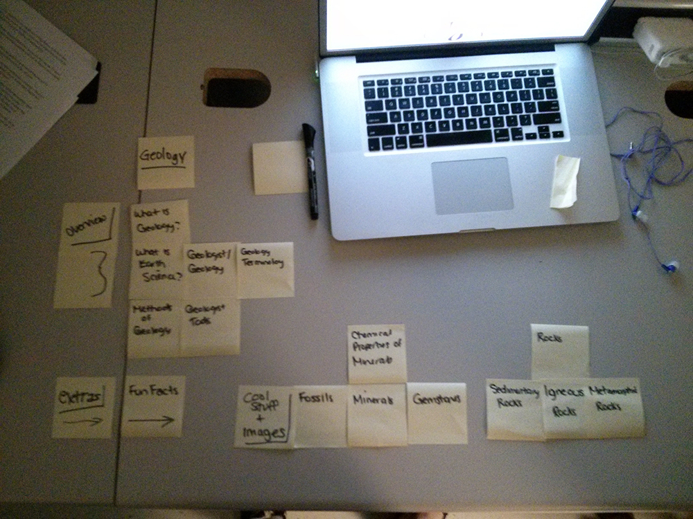
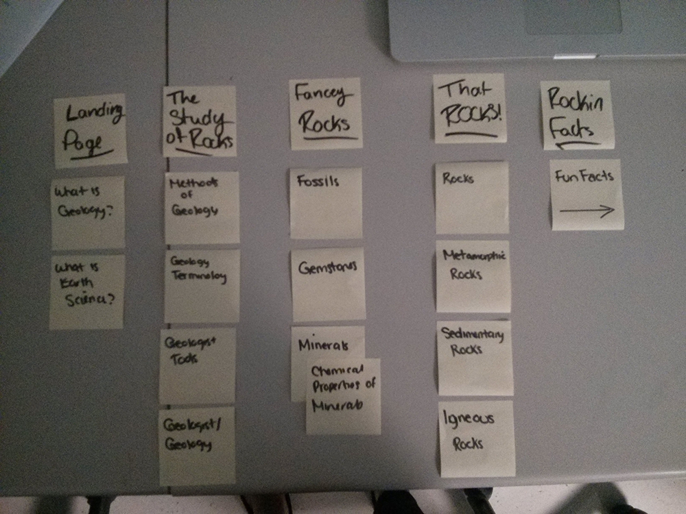

# Card Sort Report

The purpose of this card sort was to help determine a common navigation patterns/categories from the content of my large data website, regarding Geology

## Specifics

The card sort was conducted by Lisa Beaton on September 10, 2013, between the times of 8:00am and 11:00am, with the following participants:

- Stephanie Cansfield
- Robyn Rutherford

### Cards

15 cards were used covering a broad range of applicable content for the website. The following topics were used as cards: 

1.  What is Geology?
2.  What is Earth Science?
3.  Geologist Terminology
4.  Geologist Tools
5.  Methods of Geology
6.  What is a Rock?
7.  Sedimentary Rocks
8.  Igneous Rocks
9.  Metamorphic Rocks
10. Minerals
11. Chemical Properties of Minerals
12. Gemstones
13. Popular Rocks, Gems, and Minerals
14. Fossils
15. Fun Facts

## Card sort results

*Card sort 1 by Stephanie Cansfield*

*Card sort 2 by Robyn Rutherford*

## Observations

- Titles needed to be changed as they acted like categories
- no questions were asked
- some titles were harder to place in a category 
- there was a few common groupings, such as the Rocks category
- Some groupings didn't make sense to me, or category names, such as "fancy facts"
- I realized that my titles needed to be changed as it was hard to categorize them